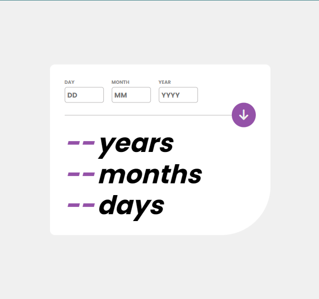

# Age Calculator App



## Description

The Age Calculator App is a simple web application that allows users to input their date of birth and calculates their age in years, months, and days. This project is built using HTML, CSS, and JavaScript.

## Features

- User-friendly interface.
- Input field for entering the date of birth.
- Calculation of age in years, months, and days.

## Technologies Used

- HTML
- CSS
- JavaScript

## Installation

1. Clone the repository to your local machine using the following command:

   ```bash
   git clone https://github.com/your-username/age-calculator-app.git
   ```

2. Navigate to the project directory:

   ```bash
   cd age-calculator-app
   ```

3. Open the `index.html` file in your preferred web browser.

## Usage

1. Enter your date of birth in the input field provided in the format DD-MM-YYYY (e.g., 15-05-1990).

2. Click the button or press Enter.

3. Your age in years, months, and days will be displayed below the input field.

4. To reset the input and result, click the "Clear" button.

## Contributing

If you would like to contribute to this project, please follow these steps:

1. Fork the repository.

2. Create a new branch for your feature or bug fix:

   ```bash
   git checkout -b feature-name
   ```

3. Make your changes and commit them:

   ```bash
   git commit -m "Description of your changes"
   ```

4. Push your changes to your fork:

   ```bash
   git push origin feature-name
   ```

5. Create a pull request on the original repository.

## License

This project is licensed under the MIT License - see the [LICENSE](LICENSE) file for details.

## Contact

If you have any questions or suggestions, please feel free to contact me at [mbas750@gmail.com](mailto:mbas750@gmail.com).

---
